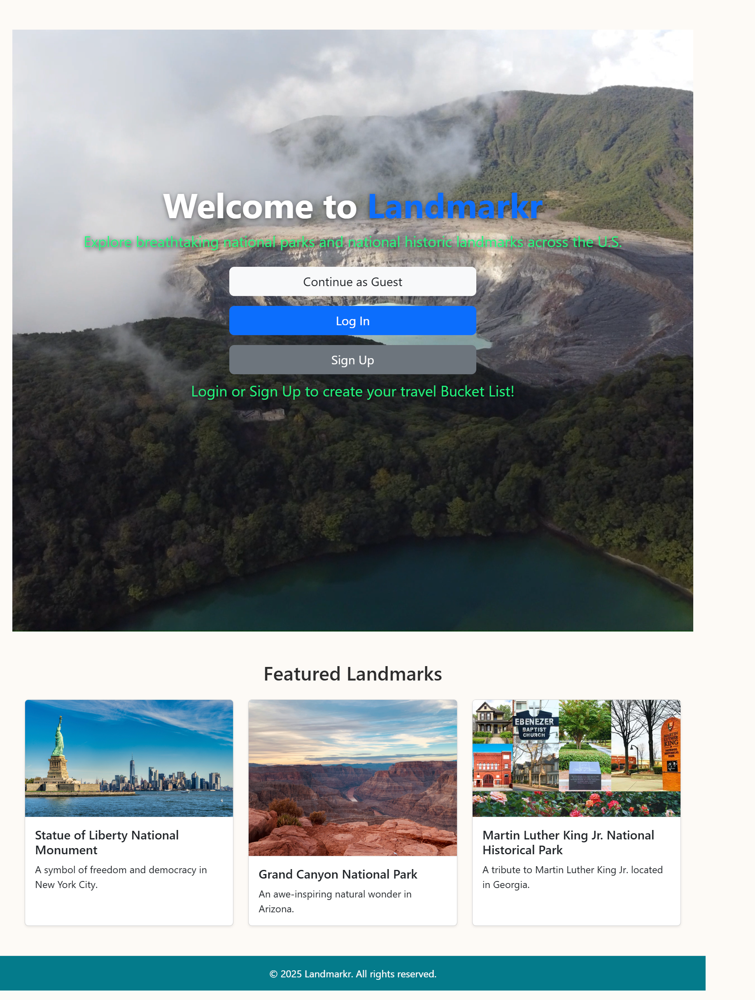
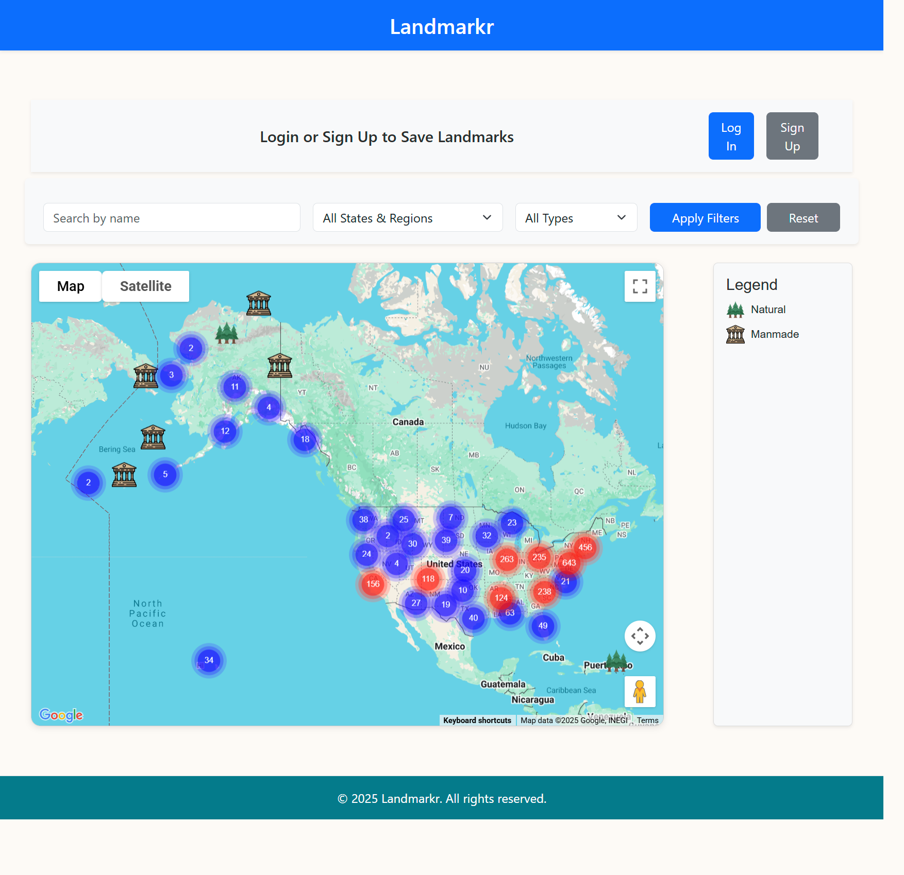
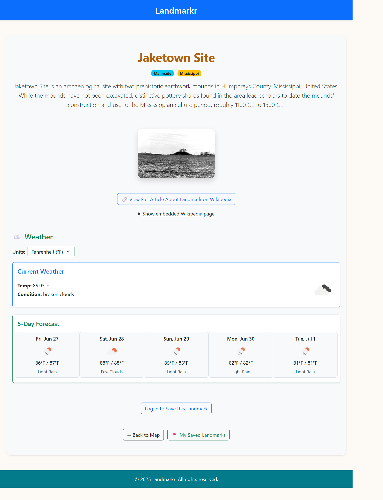
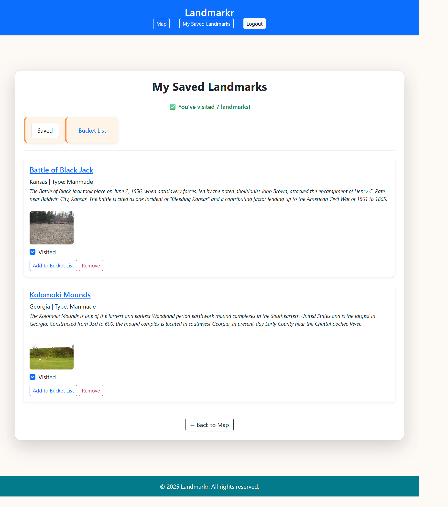

# Landmarkr 🗺️

**Landmarkr** is a web app that lets users explore, save, and manage a personalized list of national parks (natural) and national historical landmarks (manmade) across the United States. Users can interact with a dynamic map, view current and forecasted weather conditions, and organize landmarks into custom tabs such as a bucket list.

## 🌟 Features

- 🌍 Interactive map of U.S. landmarks (natural + manmade)
- 📍 Landmark detail pages with:
  - Description, image, and Wikipedia view
  - Current weather + 5-day forecast
- 🔐 User authentication
- 🪣 Save landmarks to a personal "Bucket List"
- ✅ View and manage saved landmarks
- 🔍 Filter landmarks by name, type, or state
- 📄 Wikipedia article previews and direct links

## Screenshots
- Main Screen


- Map Page


- Example landmark detail page


- Saved Landmarks page


## Tech Stack

- **Backend**: Flask, SQLAlchemy, Jinja2
- **Frontend**: HTML, CSS (custom + Bootstrap), JavaScript
- **Database**: PostgreSQL (prod) or SQLite (local dev)
- **APIs Used**:
  - Wikipedia API (landmark info)
  - Google Maps API (map display)
  - OpenWeather API (current & forecast weather)

## Setup Instructions

### 1. Clone the Repo
```bash
git clone https://github.com/your-username/landmarkr.git
cd landmarkr

### 2. Create and Activate a Virtual Environment
python3 -m venv env
source env/bin/activate   # macOS/Linux
env\Scripts\activate      # Windows

### 3. Install Dependencies
pip install -r requirements.txt

### 4. Set Up Environment Variables
**Create a .env file in the project root and include:
FLASK_APP=app.py
FLASK_ENV=development
SECRET_KEY=your-secret-key
GOOGLE_MAPS_API_KEY=your-google-key
OPENWEATHER_API_KEY=your-weather-key

### 5. Initialize the Database
flask db init
flask db migrate
flask db upgrade

### 6. Run the App
**Visit http://localhost:5000 in your browser.
flask run

### Project Structure
landmarkr/
├── api/                   # Wikipedia and weather API integrations
├── data/                  # CSV and seed data
├── static/                # CSS, JS, images, and video
├── templates/             # HTML templates (Jinja2)
├── .env                   # Environment config (ignored by Git)
├── .gitignore             # Files to be ignored by Github
├── config.py              # App configuration settings
├── crud.py                # Database helper functions
├── model.py               # SQLAlchemy models
├── README.md              # Project overview and setup
├── requirements.txt       # Project dependencies
├── seed_database.py       # Script to populate the database with landmarks
├── server.py              # Flask app entry point (use instead of app.py)

## Version 2.0
-User-created folders/tags for organizing landmarks
-Travel planning tools (e.g. driving routes, nearby places)
-User-submitted landmarks and reviews
-Random "Featured Landmarks" on homepage
-Filter by landmark type (e.g bridge, river)

